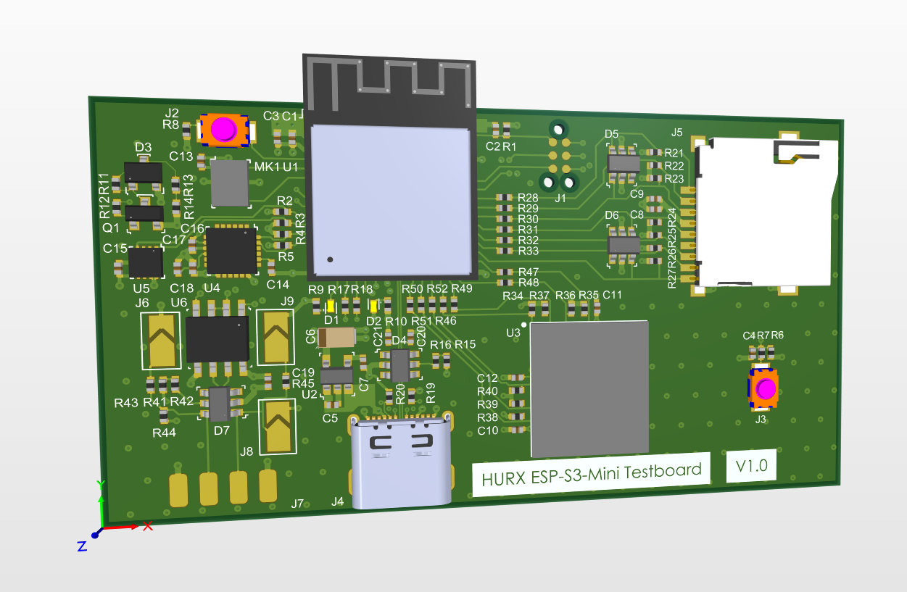

# ESP32-S3 Mini Testboard

Sent for first version to JLCPCB. The board is JLCPCB enabled (for assembly).

I am designing this board to test the new ESP-S3 Mini for development of private boards. I am especially interested in I2S, the new RISC ULP (and using I2C while sleeping), usage of eMMC, USB OTG/Mass storage.

The board has:

- SHT30 temp/humidity sensor
- MPU6050 gyro/accel sensor
- uSD slot
- eMMC chip 16 gbit
- ADC measurement as a test for BAT measurement (with mosfet, only RQ5A025ZPTL is not in stock by JLCPCB. Will assemble this one myself). In next version replacement to be considered.
- I2S mic
- RS-485
- USB-C connected to the ESP-S3 Mini chip
- Tag Connect UART/Program
- Power good led
- Extra led and button for testing (last with hardware debouncer)
- Caps for USB to be removed or replaced. Will also test highspeed USB 2.0 (possible by specification Espressif), but just to be soldered later (through hole resistor 1.5Kohm)

Always available for discussion about the board. Main purpose is to test the ESP-S3 before I use it for my other projects.

